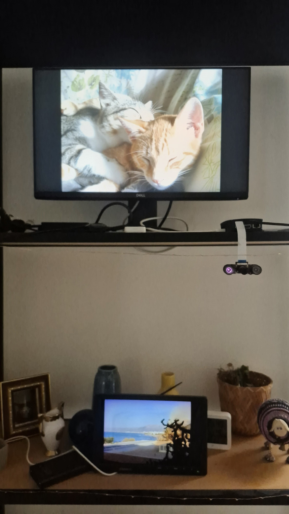
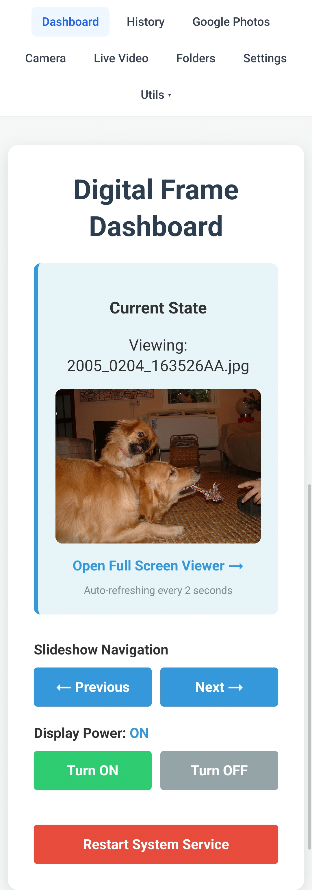

# DigitalFrame: A Professional Raspberry Pi Photo Frame & Surveillance Dashboard

**DigitalFrame** is an advanced, production-grade software suite designed to transform a Raspberry Pi with a display into a smart, interactive digital photo frame. Beyond a simple slideshow, it integrates motion-activated power management, seamless Google Photos synchronization, a real-time surveillance feed, and a customizable dashboard.

Built with a focus on **system integrity** and **smooth aesthetics**, DigitalFrame ensures your hardware is utilized efficiently while providing a beautiful, non-distracting addition to your living space.

[](https://github.com/agmonr/digitalFrame/)
[](https://github.com/agmonr/digitalFrame/)

---

## 🚀 Key Features & Highlights

### 🖼️ Intelligent Slideshow Engine
- **Hardware-Optimized Display:** Directly writes to the Linux framebuffer (`/dev/fb0`), bypassing heavy desktop environments for maximum performance and stability.
- **History-Aware Randomization:** Uses a smart 5-retry mechanism to ensure images shown in the last 24 hours are skipped, providing a fresh experience every day.
- **Smart Scaling:** Automatically resizes and centers images from multiple local and synced directories using high-quality Lanczos resampling.
- **Subtle Transitions:** Smooth transition logic with customizable intervals and directory-based filtering.

### 🔄 Intelligent Async Sync & Pipelining
- **Background Pipelining:** The system asynchronously prepares the next album in your queue while you watch the current one, ensuring zero-wait transitions between groups.
- **Adaptive Throttling:** Monitors download performance in real-time. If a slow connection is detected, the system implements a dynamic pause (50% of your image interval) to keep background tasks from impacting display performance.
- **Stable Hash-Based Sync:** Every Google Photo is identified by a unique cryptographic hash. This prevents redundant downloads if you reorder your cloud albums and ensures that once an image is deleted from the frame, it **never** syncs back.
- **Automatic Video Exclusion:** High-efficiency filtering strictly ignores video files, focusing your SD card storage solely on high-quality photography.

### 🛡️ Storage Guardrail & FIFO Eviction
- **1GB Safety Buffer:** The system constantly monitors the free space on your SD card. If space drops below 1GB, it automatically triggers an eviction process.
- **Granular FIFO Cleanup:** Unlike other systems that delete entire folders, DigitalFrame surgically removes individual images starting with the **oldest downloaded** first until the safety buffer is restored.
- **Playback Protection:** The automatic cleanup engine is "playback aware" and will never delete the image currently being displayed on your screen.

### 💾 MicroSD Card & I/O Optimization
- **Minimal Write Latency:** All transient state files (current image, sync progress, system status) are stored in **RAM (`/dev/shm`)**, eliminating thousands of unnecessary disk writes per day and extending the life of your SD card.
- **High-Performance SQLite:** The history database is tuned with WAL mode, memory-mapped I/O (`mmap`), and synchronous=OFF for maximum responsiveness on Pi hardware.
- **Config Caching:** Intelligent memory caching for `config.ini` ensures the disk is only read when settings actually change.

### 🌓 Motion-Activated Surveillance & Power
- **Vision-Based Detection:** Uses the Raspberry Pi Camera to detect movement with configurable sensitivity and auto-calibration for varying light levels.
- **Smart Power Management:** Automatically toggles HDMI/LCD power via `vcgencmd` and framebuffer blanking, extending display life and saving energy.
- **Live Video Feed:** High-efficiency MJPEG streaming provides a real-time "security cam" view accessible from any web browser.

### 📊 Real-Time Monitoring Dashboard
- **Live Sync Progress:** Monitor your Google Photos sync with granular "15/40" progress indicators.
- **"Next Up" Visual Preview:** See a thumbnail and details of the next album or image group queuing for display.
- **Storage Health:** Visual progress bars track your free space against the 1GB safety threshold.
- **Album Inventory:** View a detailed list of all locally cached albums, including disk size (MB), file counts, and precise sync timestamps.
- **Next Group Control:** A dedicated "Next Group »" button allows you to instantly skip the current set of images and jump to a new random selection.

### ☁️ Cloud & Web Integration
- **Strict Album Management:** Powerful management UI with strict naming validation (English alphanumeric) and automatic folder auto-selection for new albums.
- **System Terminal:** Integrated web-based terminal for remote administration and command execution. This feature is inspired by and based on robust PTY handling techniques found in GPLv3-licensed projects like **Butterfly**, providing a full-color, interactive shell experience.
- **Remote Control:** API-driven navigation from any device on your network.

---

## ⚖️ Licensing & Credits

DigitalFrame is primarily licensed under the **MIT License**. However, this project leverages several high-quality open-source components:

### Frontend & UI
- **[Xterm.js](https://xtermjs.org/)** (MIT): Powers the high-performance web terminal.
- **[Socket.io](https://socket.io/)** (MIT): Enables real-time, low-latency communication between the dashboard and the hardware.

### System Components
- **[Butterfly Web Terminal](https://github.com/paradoxxxzero/butterfly)** (GPLv3): The interactive terminal implementation leverages techniques and architectural patterns from this project. In accordance with the GPLv3, the terminal-specific code in this project is contributed to the community under the same terms.
- **[OpenCV](https://opencv.org/)** (Apache 2.0): Used for real-time motion detection and image analysis.
- **[Pillow (PIL)](https://python-pillow.org/)** (HPND): Primary image processing and rendering library.
- **[Nginx](https://nginx.org/)** (BSD-like): Robust web server used as a reverse proxy for the dashboard and video feeds.

---

## 🛠️ System Architecture & Tech Stack

DigitalFrame operates as a distributed system of specialized services, ensuring that display performance remains decoupled from background tasks like synchronization and motion detection.

| Component | Technology | Role |
| :--- | :--- | :--- |
| **Core Runtime** | Python 3.10+ | Primary logic and service orchestration |
| **Backend API** | Flask | RESTful interface for the dashboard and remote control |
| **Image Processing** | Pillow (PIL) | Dynamic resizing, text rendering, and buffer preparation |
| **Display Interface** | Linux Framebuffer | Direct-to-hardware rendering (`/dev/fb0`) |
| **Motion Detection** | OpenCV / NumPy | Pixel-delta analysis for movement detection |
| **Surveillance** | Libcamera / Rpicam-vid | High-performance hardware-accelerated video streaming |
| **Scheduling** | Croniter | Cron-expression parsing for display and sync tasks |

### Data & Control Flow
1. **`manager.py`**: The watchdog service that ensures all components are running and healthy.
2. **`display.py`**: The "Heart" of the system; manages the framebuffer and renders the slideshow/clock.
3. **`api.py`**: The "Brain"; handles incoming web requests, motion detection logic, and hardware power control.
4. **`downloader.py`**: The "Bridge"; periodically fetches new assets from Google Photos.

---

## 📦 Installation & Setup

### Prerequisites
- **Hardware:** Raspberry Pi (3, 4, 5 or zero2) with a connected display and Pi Camera module (optinal).
- **OS:** Raspberry Pi OS (Lite recommended) with Framebuffer support.
- **Dependencies:** `python3-venv`, `libopenjp2-7`, `libtiff6`.

### Step-by-Step Installation
1. **Clone the repository:**
   ```bash
   git clone https://github.com/yourusername/digitalframe.git
   cd digitalframe
   ```

2. **Run the installer:**
   The provided `install.sh` script automates the creation of the virtual environment and systemd services.
   ```bash
   chmod +x install.sh
   ./install.sh
   ```

3. **Configure the Environment:**
   Edit `config.ini` to set your image directories and preferences:
   ```ini
   [DEFAULT]
   imagedir = /home/photos/pictures/
   interval = 60
   screenoffhour = 00
   screenonhour = 6
   ```

4. **Set up Nginx (Optional but Recommended):**
   Copy `digitalframe.nginx` to your Nginx sites-available for professional web access to the dashboard.

---

## 🖱️ Usage & Automation

### Starting the System
The system is designed to run headlessly via systemd services (`frame.service`, `frame-api.service`).
- **Manual Start:** `./run_frame.sh`
- **Check Logs:** `tail -f logs/digitalframe.log`

### Automated Tasks
- **Syncing Albums:** Occurs hourly via a background thread in `api.py`.
- **Motion Detection:** Runs continuously; logs movement and screen toggles to `logs/api.log`.
- **Scheduled Display:** The screen will automatically blank according to `screenoffhour` and `screenonhour`.

---

## 📜 Development & Evolution

DigitalFrame evolved from a simple Python script into a robust service-oriented architecture. Key milestones include:
- **Phase 1: Direct Rendering.** Transitioned from X11-based windows to direct Framebuffer manipulation for better Pi Zero/Lite performance.
- **Phase 2: Power Intelligence.** Integrated hardware-level power controls (`vcgencmd`) coupled with software-level motion detection.
- **Phase 3: Smooth UI.** Implemented harmonic motion for the clock to solve the critical "burn-in" issue common in always-on IPS/OLED displays.
- **Phase 4: Unified Control.** Added a Flask-based REST API and responsive Dashboard to eliminate the need for SSH access for daily management.

---
*Developed with ❤️ for the Raspberry Pi community.*
